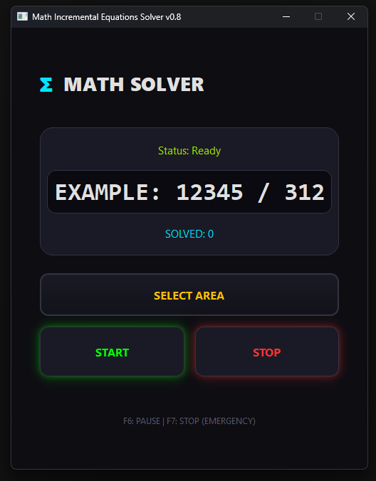

# 🧮 Math Incremental Equations Solver v0.8



Автоматизированный бот для решения математических примеров в Roblox плейсе Math Incremental. Использует нейросеть для чтения экрана и низкоуровневую эмуляцию мыши для выбора ответов.

## 📥 Инструкция по установке (Быстрый старт)

Для обычных пользователей установка максимально проста:

1. Перейдите в раздел **[Releases](https://github.com/7FireStar7/Math-Incremental-Equations-Solver/releases)** на этом репозитории.
2. Скачайте архив `Math-Incremental-Equations-Solver....zip`.
3. **Распакуйте архив 1** в любую удобную папку (второй подхватиться автоматически)
4. Запустите файл **`Math-Incremental-Equations-Solvev0.8.exe`**.

> **Важно:** Запускайте программу от **имени администратора**, иначе клики в игре могут не срабатывать.

---

## 🖱️ Технические особенности (SendInput)

В Roblox встроена защита от обычной эмуляции мыши (через Python библиотеки). Мы обошли это, внедрив метод **SendInput**:
* **Низкоуровневый ввод:** Бот общается напрямую с системой через `user32.dll`.
* **Аппаратная точность:** Координаты конвертируются в виртуальные единицы Windows (0-65535).
* **Человеческое движение:** Курсор не "телепортируется", а плавно подлетает к кнопке, имитируя движение реального сенсора.

---

## ⚙️ Требования для стабильной работы
* **Масштаб экрана:** 100% (в настройках Windows).
* **Режим окна:** Оконный или "Окно без границ".
* **Камера в игре:** Режим `Classic` (в настройках Roblox).

---

## 🚀 Что нового в версии 0.8.0

В этом обновлении мы сосредоточились на стабильности распознавания и полностью переработали визуальную часть программы.

### 🎨 Интерфейс и дизайн (UI/UX)
* **Skeuomorphic Design:** Полностью обновлен внешний вид. Теперь интерфейс имитирует реальные физические объекты с объемами, фасками и тенями.
* **Neon Glow:** Добавлено динамическое неоновое свечение для кнопок **START** (зеленое) и **STOP** (красное).
* **Компактность:** Оптимизирована высота окна и отступы, чтобы программа занимала меньше места на экране.
* **Σ Logo:** Добавлен фирменный логотип и обновлено название программы.

### 🧠 Исправления и логика (Core)
* **Подготовка к запуску:** Добавлена обязательная 5-секундная задержка после нажатия кнопки **START**, чтобы пользователь успел переключиться на окно игры.
* **Анти-ступор:** Реализована логика "проталкивания" — если решение не находится 3 цикла подряд, бот совершает клик по любому доступному варианту, чтобы сбросить застрявший экран.

### 🛠 Технические улучшения
* **GPU Acceleration:** Исправлена критическая ошибка инициализации `EasyOCR`, теперь обработка на видеокартах NVIDIA работает корректно.
* **WinAPI Mouse:** Переход на прямые вызовы Windows API для перемещения курсора (мгновенный отклик).
* **Библиотеки:** Исправлены конфликты импортов в PyQt6.


## 🛠️ Для разработчиков
Если вы хотите изменить код, вам понадобятся:
```bash
pip install easyocr opencv-python pywin32 PyQt6 mss
Запуск из исходников: python main.py

⚠️ Дисклеймер
Проект создан в образовательных целях. Автор не несет ответственности за блокировки аккаунтов. Используйте на свой страх и риск.


